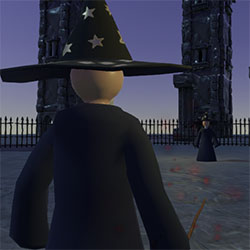

# Duel-Magic

A Unity game I made for my intermediate exam.

Two wizards battle it out in a duel of magic. They are trapped in an arena.  
They shoot magic missiles at each other and try to defend against the attacks at the same time.

## How to play

You need two players and two X-Box controllers to play this game.  
The game is in splitscreen mode. Use the left stick to move around the arena and the right stick to offset your aim. You will always automatically look at your opponent.  
Use the right trigger to shoot magic missiles and the left trigger to summon a shield that blocks the enemies missiles. These actions cost you magic points. You can see your magic meter slowly fill up again over time.
Additionally you can switch the color of your missiles and shield. There are three colors which have a rock-paper-scissor-like advantage/disadvantage over each other. Switching the color costs a lot of magic and has a cooldown though.